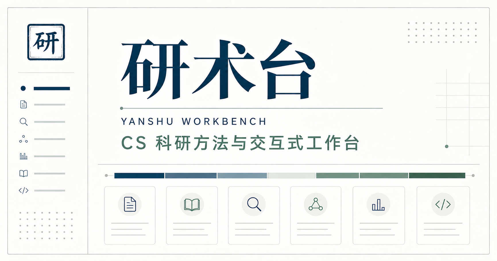

<div align="center">



# 研术台 · YanShu Workbench

**面向 CS 研究者的科研方法文档站与交互式科研工作台**

把论文结构、篇幅约束、科研绘图与投稿筛选整理为可配置、可审计、可直接复制的双语 Prompt。

[](https://nextjs.org/)
[](https://react.dev/)
[](https://www.typescriptlang.org/)
[](https://pages.cloudflare.com/)

[在线使用](https://yanshu-workbench.pages.dev/) ·
[科研绘图](https://yanshu-workbench.pages.dev/figures/) ·
[投稿策略](https://yanshu-workbench.pages.dev/submission/)

</div>

## 这是什么

研术台不是普通的 Markdown 文档站，也不是替作者“一键写论文”的黑盒工具。它将科研写作中的关键决策显式化，让研究者先配置任务边界，再获得与当前设置同步的完整 Prompt。

当前版本聚焦计算机科学论文，支持中文与英文界面，并将界面语言和 Prompt 语言分别建模，便于后续扩展。

## 当前工作台

| 模块 | 能做什么 | 当前能力 |
| --- | --- | --- |
| [论文重构](https://yanshu-workbench.pages.dev/) | 规划会议或期刊论文的结构与篇幅 | 正文字数模式、章节预算、附录规则、方法与实验不限字数、四步双语 Prompt |
| [科研绘图](https://yanshu-workbench.pages.dev/figures/) | 为论文生成一项独立绘图任务 | 引言图、方法总览图、关键技术细节图三选一；占栏、常用或自定义画布比例、颜色与字号约束 |
| [投稿策略](https://yanshu-workbench.pages.dev/submission/) | 构造可核验的期刊筛选任务 | OA、APC、JCR 与中科院分区、SCIE / SSCI / ESCI 等条件 |

## 设计原则

- **配置驱动**：论文类型、字数、章节、附录和绘图规则集中维护，不把产品规则散落在界面中。
- **一项 Prompt，一项任务**：减少一次对话同时承担多个目标造成的遗漏与混乱。
- **中英文可控**：不依赖运行时机器翻译，界面和 Prompt 使用经过维护的双语文案。
- **术语忠实**：科研绘图要求图中文字与论文术语、大小写、连字符和符号完全一致。
- **克制可读**：优先服务长文本阅读、快速配置和复制操作，不采用营销页或普通 SaaS 后台风格。

## 本地运行

需要 Node.js `22.13.0` 或更高版本；推荐通过 `nvm` 使用 Node 22。

```bash
cd site
nvm use 22
npm install
npm run dev
```

打开 `http://localhost:3000`。

## 质量检查

```bash
cd site
nvm use 22
npm run lint
npm test
npm run build:pages
```

`npm test` 会先执行正式构建，再检查主要页面的服务端渲染结果与关键产品约束。

## 项目结构

```text
yanshu-workbench/
├── README.md
└── site/
    ├── app/
    │   ├── figures/          # 科研绘图配置、交互与 Prompt 构造
    │   ├── submission/       # 投稿策略筛选与 Prompt 构造
    │   └── ...               # 论文重构与全站导航
    ├── content/prompts/      # 参数模型、写作模板与字数规则
    ├── public/               # 站点图像等静态资源
    └── tests/                # 构建产物与产品规则测试
```

## 路线图

- [x] 论文重构工作台
- [x] 独立的科研绘图 Prompt
- [x] 投稿目标筛选与官网核验 Prompt
- [ ] 独立首页与项目概览
- [ ] 学术写作风格模块
- [ ] 具体会议、期刊与出版社配置
- [ ] 关于研术台与方法说明

## 使用边界

站内的会议、期刊、篇幅与结构设置是通用产品预设，不代表任何具体 venue 的官方要求。投稿前请始终以目标会议、期刊和出版社的最新官网、作者指南及模板为准。

本站生成的是可复制 Prompt；论文材料在你选择的模型对话中处理，研术台网页本身不读取或保存上传文件。

## 反馈

发现规则冲突、文案问题或希望增加新的科研场景，欢迎提交 [Issue](https://github.com/panzhzh/yanshu-workbench/issues)。

---

<div align="center">
  <sub>YanShu Workbench · Research methods and interactive tools for CS researchers.</sub>
</div>
